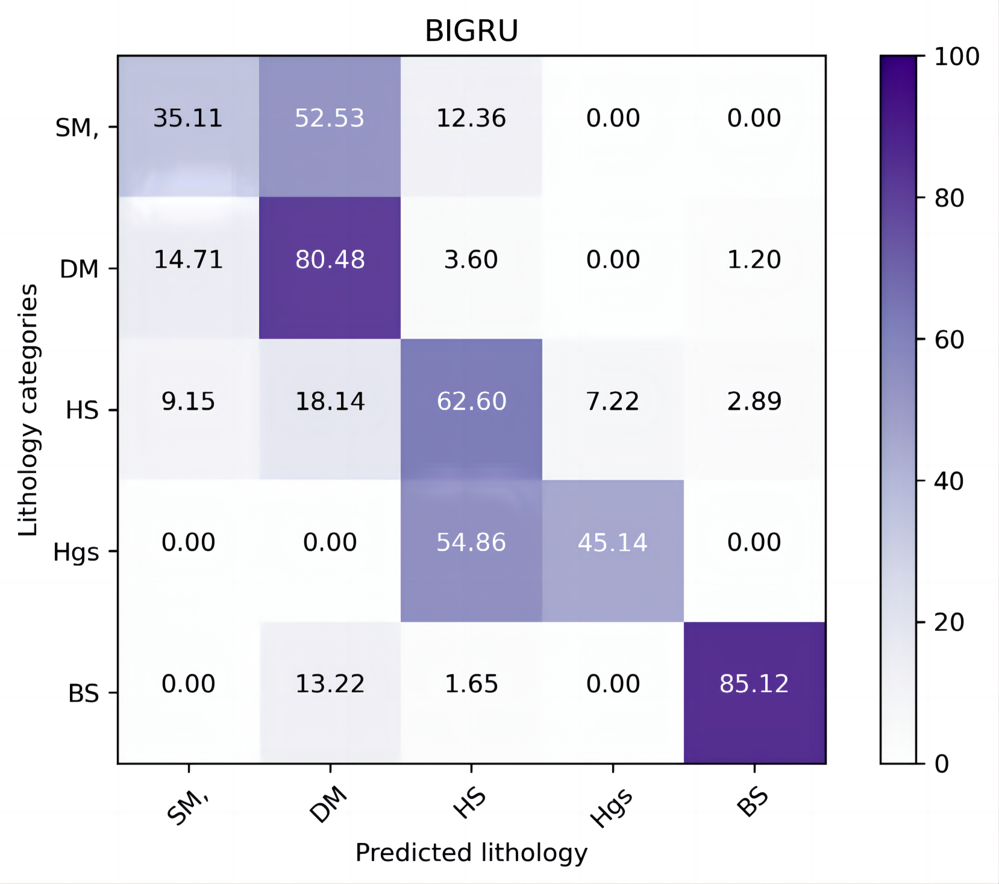

# **Intelligent lithologic identification**
## Running screenshots show

- **Comparison of Confusion Matrices for Different Model Predictions on the Daqing Dataset**

  
  
  

  
  
  

- **Comparison of Confusion Matrices for Different Model Predictions on the Xinjiang Dataset**

  
  
  

  
  
  

- **Comparison of Confusion Matrices for Different Model Predictions on the Daqing Blind Well Dataset**

  
  
  

  
  
  

- **Lithologic visualization**

  
  

***
## Paper Support
- Original information: LMAFNet: Lightweight Multi-Scale Adaptive Fusion Network
with Vertical Reservoir Information for Lithology Identification
***
## Description of the project
To reduce the impact of data imbalance and increase the accuracy of lithology identification, a lightweight multi-scale adaptive convolutional neural network is proposed in this paper. This model not only effectively captures the spatial nonlinear correlations of logging curves but also dynamically adapts to varying scales and complexities of lithological data to a certain extent.
***
## Functions of the project
The LMAFNet is primarily composed of three modules: a Data Multi-Scale Preprocessing Module, a Multi-Scaled Adaptive Weighted Convolutional Neural Network Module, and a Channel-Wise Attention Module. 
***
## The operating environment of the project
-	Python == 3.8.17
- conda == 4.10.3
-	pandas == 1.4.2
-	numpy == 1.1.9
-	matplotlib == 3.4.3
-	seaborn == 0.12.2
-	scikit-learn == 1.3.0
- pickleshare == 0.7.5
***
## How to use the project
Due to ongoing research projects, these data have been desensitized, and here is a part of them. The complete data will be uploaded subsequently.
#### 1、**example_daqing.xls** is a part of logging data from Daqing dataset, with 466 lines of data.

#### 2、**example_xinjiang.xls** is a part of the well logging data from a well in the tarim basin Northern area of Xinjiang, with 329 lines of data.

#### 3、**main. py** is executed on two datasets. It performs lithology identification through a lightweight multi-scale adaptive fusion network.

